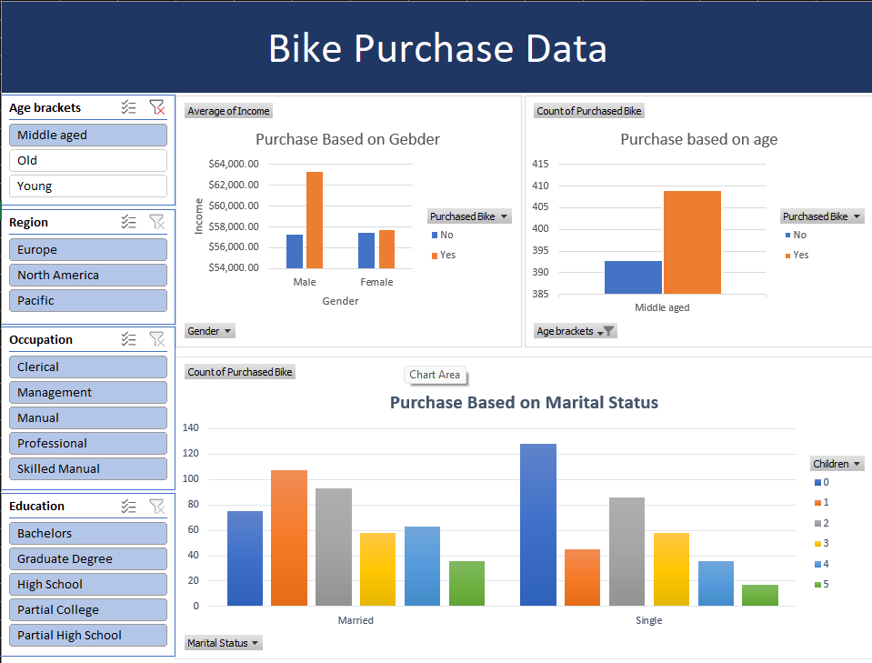

# Excel_Bike_sales

# Sales Dashboard using Microsoft Excel

## Project Overview

This project demonstrates the complete data analysis workflow using Microsoft Excel. The project includes data cleaning, transformation, pivot table analysis, and an interactive dashboard to generate meaningful business insights from a sales dataset.

---

## Objectives

- Clean and prepare raw sales data
- Transform data for analysis
- Create Pivot Tables for summarization
- Build an interactive dashboard
- Identify sales trends and key performance indicators (KPIs)

---

## Tools Used

- Microsoft Excel
- Pivot Tables
- Pivot Charts
- Slicers
- Conditional Formatting

---

## Skills Demonstrated

- Data Cleaning
- Data Transformation
- Dashboard Development
- Data Visualization
- Pivot Table Analysis
- Business Reporting

---

## Workbook Structure

### 1. bike_buyers
Contains the original dataset used for analysis.

### 2. working data set
Contains the cleaned and transformed dataset prepared for reporting.

### 3. pivot table
Contains Pivot Tables created to summarize and analyze the data.

### 4. Dashboard
Interactive dashboard displaying sales insights using charts, KPIs, and slicers.

---

## Dashboard Preview

(Add a screenshot named `dashboard.png` here)

---

## Key Insights

The dashboard enables analysis of:

- Customer demographics
- Purchasing behavior
- Income levels
- Commute distance
- Age groups
- Regional trends

---

## Project Files

- Excel Project Dataset.xlsx
- dashboard.png

---

## Author

**Mukul**
